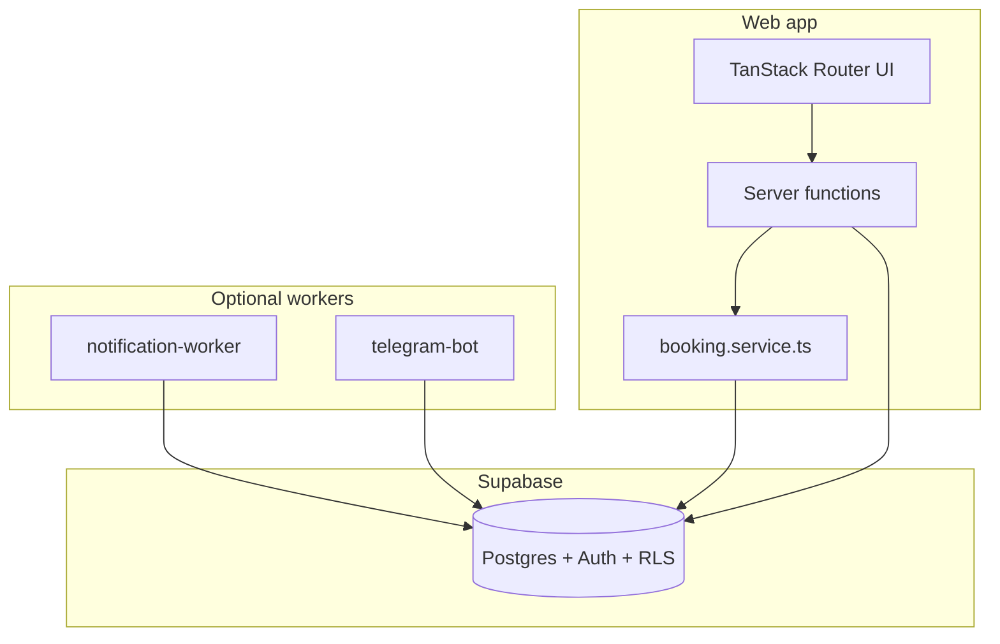

# آغاز (Aghaz) — Product & engineering roadmap

This document is the authoritative phased roadmap for the آغاز shared workspace platform: what exists today, what each phase delivers, known risks, and future ideas. It reflects the **actual codebase** (not aspirational marketing copy).

**Status legend**

| Status | Meaning |
|--------|---------|
| **Done** | Shipped and usable end-to-end in the web app |
| **Partial** | Core logic or schema exists; production wiring or UX incomplete |
| **Scaffolded** | Minimal code or tables; not production-ready |
| **Planned** | Not started |

---

## 1. Product vision

آغاز is a smart coworking platform where members:

- Browse **live desk availability** on a map
- **Reserve** a specific desk hourly, daily, or monthly
- Manage bookings in **account / dashboard**
- (Future) Pay online, use a **wallet**, get **Telegram** alerts, and **open the door** via ESP during active bookings

Staff run day-to-day operations in an **admin panel**: desks, rates, bookings, members, roles, and finance ledger.

**Stack (unchanged):** React 19 + TanStack Start (SSR, server functions) + Supabase (Postgres, Auth, RLS). Optional **background workers** for notifications and Telegram.



---

## 2. Implementation status snapshot

| Area | Status | Key files / routes |
|------|--------|-------------------|
| Landing + marketing | Done | `src/routes/index.tsx`, `site-assets.ts` |
| Live desk map (4 availability modes) | Done | `LiveDeskMap.tsx`, `desk-display-meta.ts`, `week-availability-grid.tsx`, `listPublicDesks` |
| Global pricing (`pricing_settings`) | Done | `getPublicPricing`, `/admin/pricing`, landing `#pricing` |
| User booking (pending/unpaid) | Done | `createUserBooking`, `BookingDialog.tsx` |
| Account: profile | Done | `account.tsx`, `updateMyProfile` |
| Account: my bookings + cancel | Done | `account.tsx`, `cancelMyBooking` |
| Member dashboard | Partial | `dashboard.tsx` — bookings list + receipts; no door button |
| Admin: bookings / desks / members / finance | Done | `admin/*`, `admin.functions.ts` |
| Phone OTP auth | Partial | `auth.server.ts`, `sms.server.ts` — demo OTP when SMS unavailable |
| Zarinpal payment | Partial | `payment.server.ts`, `/api/payment/callback`, account pay button |
| Wallet | Partial | `wallet.functions.ts`, DB tables — no top-up UI, non-atomic updates |
| Notifications | Partial | DB trigger + `notification-worker` scaffold |
| Telegram bot | Scaffolded | `apps/telegram-bot/index.ts` |
| Smart door (ESP) | Scaffolded | `door.functions.ts`, `door_events` table |
| Automated tests | Planned | none |

For architecture detail see [ARCHITECTURE.md](./ARCHITECTURE.md). For local setup see [DEVELOPER.md](./DEVELOPER.md).

---

## 3. Phase A — MVP (desk booking loop)

**Outcome:** Member sees real desks, books a specific desk, views reservations, staff manages everything. **No SMS or online payment required** for MVP — bookings default to `pending` + `unpaid`; staff confirm manually.

**Phase status: Done** (see [MVP_CHECKLIST.md](./MVP_CHECKLIST.md) for manual verification).

### Milestone A1 — Shared booking logic + security

| Item | Status | Location |
|------|--------|----------|
| Central pricing from `desks` rates | Done | `src/lib/booking.service.ts` |
| `start_at` / `end_at` from type + date + duration | Done | `computeBookingWindow()` |
| Booking codes `AGZ-*` | Done | `generateBookingCode()` |
| Overlap / double-booking rejection | Done | `isDeskAvailable()`, SQL `is_desk_available()` |
| `createUserBooking` (pending/unpaid) | Done | `src/lib/booking.functions.ts` |
| Staff-only `createBooking` | Done | `src/lib/admin.functions.ts` + `requireStaff()` |
| `checkDeskAvailability` | Done | `booking.functions.ts` |

**Migration:** `supabase/migrations/20260809120000_booking_availability.sql`

**Acceptance:** Users cannot self-insert paid/confirmed bookings; overlapping desk/time rejected.

### Milestone A2 — Live desk map (public)

| Item | Status | Location |
|------|--------|----------|
| `listPublicDesks` (no auth) | Done | `booking.functions.ts` |
| Display status: free / held / busy | Done | `mapPublicDesk()`, `LiveDeskMap.tsx` |
| Pass selected desk into booking | Done | `useBooking().open({ desk, type? })` |
| Scroll-to-map funnel on landing | Done | `scrollToLiveMap()`, `prepareTier()`, header/hero/pricing CTAs |
| Preferred tier banner on map | Done | `LiveDeskMap.tsx` when `prepareTier()` was used |
| Availability mode toggle (لحظهای/اول میز/اول زمان/هفته) | Done | `LiveDeskMap.tsx`, `desk-display-meta.ts` |
| 7-day week planner | Done | `week-availability-grid.tsx` |

**Acceptance:** Admin desk/rate changes and new bookings affect map after re-fetch. Landing CTAs scroll to `#desks`; dialog opens only after desk selection on the map (or from non-landing header). A 4-mode toggle on the map card switches availability between live, window, and 7-day views.

### Milestone A3 — Wire booking dialog to database

| Item | Status | Location |
|------|--------|----------|
| Prices from selected desk (not hardcoded) | Done | `BookingDialog.tsx` |
| Auth gate + pending booking resume | Done | `sessionStorage`, `/auth?redirect=/` |
| Receipt shows pending/unpaid | Done | Receipt status labels |
| Business hours 08–20 (hourly) | Done | `BUSINESS_HOUR_*` in booking.service |

**Acceptance:** Booking row appears in Supabase and admin immediately after confirm.

### Milestone A4 — User reservations

| Item | Status | Location |
|------|--------|----------|
| «رزروهای من» on account | Done | `account.tsx` |
| `listMyBookings` | Done | `admin.functions.ts` |
| Cancel own pending bookings | Done | `cancelMyBooking` |

### Milestone A5 — Admin MVP workflow

| Item | Status | Location |
|------|--------|----------|
| Filter by status | Done | `admin/bookings.tsx` |
| Confirm / cancel / toggle payment | Done | `updateBooking` |
| Manual paid for cash at desk | Done | Payment status toggle in UI |

### Milestone A6 — Auth stability

| Item | Status | Location |
|------|--------|----------|
| Returning-user sign-in | Done | `issueSessionToken` handles existing users |
| Demo OTP for dev | Done | `demoCode` when SMS not sent; banner in `auth.tsx` |
| Service role documented | Done | `.env.example` |

### Milestone A7 — Ship checklist

See [MVP_CHECKLIST.md](./MVP_CHECKLIST.md).

---

## 4. Phase B — Payments + SMS OTP

**Outcome:** Real OTP via SMS; online payment auto-confirms bookings.

**Phase status: Partial**

| Milestone | Work | Status | Notes |
|-----------|------|--------|-------|
| B1 SMS | Kavenegar in `requestPhoneOtp` | Partial | `src/lib/sms.server.ts`; needs `KAVENEGAR_API_KEY`; disable `OTP_DEMO_MODE` in prod |
| B2 Payment gateway | Zarinpal request + redirect | Partial | `src/lib/payment.server.ts`; sandbox by default |
| B3 Webhook / callback | Verify payment → update booking | Partial | `src/routes/api/payment/callback.tsx`, `processPaymentCallback()` |
| B4 User pay flow | Pay from account | Partial | «پرداخت آنلاین» on unpaid bookings; dialog still «ثبت رزرو» without pay gate |
| B5 Notifications prep | `notifications` table + trigger | Partial | No email provider; web channel only in worker |

**Required env:** `SITE_URL`, `ZARINPAL_MERCHANT_ID`, `KAVENEGAR_API_KEY`, `OTP_DEMO_MODE=false` (production)

**Remaining work**

- Gate production: never return `demoCode`
- Require payment before auto-confirm (or clear UX for pay-later)
- Email or in-app notification center for «پرداخت موفق»
- IDPay as alternative gateway (optional)

---

## 5. Phase C — Wallet

**Outcome:** Users hold balance; pay bookings from wallet; staff can adjust balances.

**Phase status: Partial**

| Item | Status | Location |
|------|--------|----------|
| `wallets`, `wallet_transactions` tables | Done | `20260809120100_platform_extensions.sql` |
| `getWalletBalance` | Done | `wallet.functions.ts` |
| `payBookingFromWallet` | Partial | Sequential updates — not atomic DB transaction |
| `adjustWalletBalance` (staff) | Done | Server function only |
| Account: show balance + pay from wallet | Partial | `account.tsx` |
| Top-up via payment gateway | Planned | — |
| Admin wallet UI | Planned | — |

**Dependency:** Wallet top-up realistically needs Phase B payment gateway.

---

## 6. Phase D — Notification platform

**Outcome:** Event-driven notifications for web, SMS, Telegram; reminders before booking start.

**Phase status: Partial**

| Item | Status | Location |
|------|--------|----------|
| `notifications` table | Done | Migration |
| Trigger on booking insert/status change | Done | `enqueue_booking_notification()` |
| Delivery worker | Scaffolded | `services/notification-worker/index.ts` |
| 30 min before `start_at` reminder | Planned | Needs cron or scheduled job |
| SMS channel delivery | Planned | Extend worker + Kavenegar |
| In-app notification UI | Planned | Read `notifications` in dashboard |

**Run worker:**

```sh
node --import tsx services/notification-worker/index.ts
```

Requires `SUPABASE_URL`, `SUPABASE_SERVICE_ROLE_KEY`; optional `TELEGRAM_BOT_TOKEN` for telegram channel.

---

## 7. Phase E — Telegram bot

**Outcome:** Link account, receive alerts, list bookings (later: book/cancel via bot).

**Phase status: Scaffolded**

| Item | Status | Location |
|------|--------|----------|
| `profiles.telegram_id` | Done | Migration |
| Bot: `/start`, `/help`, `/my` | Scaffolded | `apps/telegram-bot/index.ts` |
| Bot: `/link` account | Scaffolded | Weak — not secure link-token flow |
| Bot: `/book`, `/cancel` | Planned | Should reuse `booking.service.ts` |
| GrammY / webhook mode | Planned | Currently raw polling API |

**Run bot:**

```sh
node --import tsx apps/telegram-bot/index.ts
```

Requires `TELEGRAM_BOT_TOKEN` + Supabase service role.

**Known gap:** `/link` does not use a dedicated one-time link token table — not production-ready.

---

## 8. Phase F — Smart door (ESP)

**Outcome:** User with active confirmed booking requests unlock; ESP executes relay; all attempts audited.

**Phase status: Scaffolded**

| Item | Status | Location |
|------|--------|----------|
| `door_events` audit table | Done | Migration |
| `requestDoorUnlock` (member) | Scaffolded | `door.functions.ts` — validates confirmed + paid + time window |
| `verifyDoorUnlockToken` (ESP) | Scaffolded | Short-lived token; needs `DOOR_DEVICE_API_KEY` |
| Member UI «باز کردن درب» | Planned | Wire `dashboard.tsx` to `requestDoorUnlock` |
| ESP32 firmware + relay | Planned | — |
| MQTT broker or HTTPS to device | Planned | — |

**Dependency:** Confirmed bookings (Phase A staff confirm or Phase B/C payment).

**Env:** `DOOR_DEVICE_API_KEY` — shared secret between server and ESP; never expose to browsers.

---

## 9. Issues, risks, and heads-up

Read this before production deploy or exposing the app to real members.

### Security and authentication

- **Demo OTP:** If SMS fails and (`NODE_ENV !== 'production'` OR `OTP_DEMO_MODE=true`), the OTP is returned in the API and shown in the UI. **Never enable demo mode in production.**
- **Service role key:** `SUPABASE_SERVICE_ROLE_KEY` bypasses RLS. Server-only. Never commit or ship to the client bundle.
- **RLS + staff checks:** Admin handlers call `requireStaff()`; RLS remains the primary guard. Re-verify policies after any migration.
- **Door tokens:** 60-second unlock tokens must not be logged on ESP serial output in production.

### Payments (Zarinpal)

- **`SITE_URL`** must exactly match the public site URL used in Zarinpal callback. Wrong URL → payments succeed at gateway but bookings stay unpaid in DB.
- **Sandbox:** Default merchant ID works for dev; production needs real Zarinpal merchant + HTTPS.
- **Currency:** Amounts are stored as integer **toman**. Confirm Zarinpal configuration matches (not rials × 10 mismatch).

### Booking and UX

- **Timezone:** Business hours use Iran offset **+03:30** hardcoded in `booking.service.ts`. Other regions or DST need code changes.
- **Pricing:** Landing `#pricing`, booking dialog defaults, and admin **تعرفه‌ها** read from `pricing_settings`. Per-desk rates on `desks` can still differ — map and dialog show the selected desk’s rates.
- **Desk `status` vs bookings:** Map computes availability from bookings; manual `desks.status` (maintenance) also affects display. Staff should keep desk records consistent.
- **MVP flow:** Bookings are `pending` until staff confirms or payment completes — members must understand «در انتظار تأیید».

### Infrastructure

- **Migrations:** Run `supabase db push` (or apply SQL in order). Missing tables (`payment_orders`, `wallets`, etc.) cause runtime errors.
- **Workers not in Docker by default:** Notification worker and Telegram bot must run separately (VPS, Railway, systemd). See [SELF_HOSTING.md](./SELF_HOSTING.md).
- **No automated tests:** Regressions are caught only via manual checklist. High-risk paths: OTP, overlap logic, payment callback, wallet debit.

### Scaffold limitations

- **Telegram `/link`:** Not secure; implement proper link-token table before marketing the bot.
- **Wallet payments:** `payBookingFromWallet` uses sequential Supabase calls, not a single Postgres transaction — rare race under concurrent requests.
- **Notification worker:** No retry backoff or dead-letter queue for failed Telegram sends.

### Legacy branding

- Auth synthetic email: `@phone.hayat.space` in `auth.server.ts` (legacy Hayat Space spec). Product brand is آغاز.
- Booking codes: `AGZ-*` (correct). Some check-in strings may still reference Hayat in older copy.

---

## 10. Future features and ideas

Not committed to the roadmap — candidates for post-Phase F.

### Product and UX

- **Realtime desk map** — Supabase Realtime on `bookings` / `desks` (no manual refresh)
- **Booking extension** — «15 minutes left» notification + one-tap extend if desk still free
- **Full member dashboard** — next booking, door button, check-in QR at reception
- **PWA** — installable mobile experience
- **Multi-location** — branches, floor plans, per-site admins
- **Other resources** — meeting rooms, lockers, parking as bookable entities
- **Guest passes** — time-limited visitor QR access

### Payments and monetization

- **IDPay** (or second gateway) alongside Zarinpal
- **Legal invoice PDF** with tax fields for businesses
- **Monthly auto-renew** subscriptions
- **Corporate accounts** — one billing entity, many members
- **Promo codes** and referral credits

### Operations

- **Maintenance calendar** — block desks for cleaning without fake bookings
- **Occupancy analytics** — heatmaps, peak hours, revenue per desk
- **Auto «done»** status when `end_at` passes
- **Accounting export** — CSV / webhook to external systems

### Access and hardware

- **ESP32 sample firmware** + relay wiring guide
- **MQTT broker** (managed or self-hosted mosquitto) for door commands
- **NFC check-in** at reception or door
- **Wi-Fi voucher** tied to active booking duration

### Communications

- **GrammY Telegram bot** with full `/book` flow sharing `booking.service.ts`
- **SMS reminders** — booking confirmed, 30 minutes before start
- **In-app notification center** — bell icon reading `notifications` table

### Platform and engineering

- **`packages/core`** — shared booking rules for web, workers, bot
- **E2E tests** (Playwright): signup → book → pay → admin confirm
- **Atomic wallet/payment** — Postgres functions or `supabase.rpc` transactions
- **Secure Telegram link tokens** — dedicated table with expiry
- **Use `is_desk_available` RPC** everywhere for consistency
- **Migrate auth email domain** to `@phone.aghaz.space` (or similar)

---

## 11. Suggested timeline (indicative)

| Phase | Focus | Effort | Depends on |
|-------|--------|--------|------------|
| **A MVP** | Live desks + real bookings + admin | 2–4 weeks | Supabase + migrations |
| **B** | SMS + payment + callback | 1–2 weeks | A, HTTPS, merchant account |
| **C** | Wallet top-up + admin UI | 1–2 weeks | B (for top-up) |
| **D** | Reminders + reliable delivery | 1 week | Workers deployed |
| **E** | Production Telegram bot | 1–2 weeks | D notifications, secure link |
| **F** | ESP door end-to-end | 2–3 weeks | B or A confirm flow, hardware |

Parallel work: documentation (this file), branding cleanup, E2E tests can start anytime.

---

## 12. File reference (quick map)

| Concern | Primary files |
|---------|----------------|
| Booking rules | `src/lib/booking.service.ts` |
| Public + user booking API | `src/lib/booking.functions.ts` |
| Admin API | `src/lib/admin.functions.ts` |
| Auth / OTP | `src/lib/auth.server.ts`, `src/lib/auth.functions.ts`, `src/lib/sms.server.ts` |
| Payment | `src/lib/payment.server.ts`, `src/lib/payment.functions.ts`, `src/routes/api/payment/callback.tsx` |
| Wallet | `src/lib/wallet.functions.ts` |
| Door | `src/lib/door.functions.ts` |
| UI: map + book | `LiveDeskMap.tsx`, `BookingDialog.tsx`, `scroll-to-live-map.ts` |
| UI: landing pricing | `index.tsx` (`#pricing`), `getPublicPricing` |
| Admin pricing | `admin/pricing.tsx`, `pricing_settings` table |
| UI: account / dashboard | `account.tsx`, `dashboard.tsx` |
| Workers | `services/notification-worker/`, `apps/telegram-bot/` |
| Schema | `supabase/migrations/` |

---

## 13. Related documents

| Document | Contents |
|----------|----------|
| [ARCHITECTURE.md](./ARCHITECTURE.md) | System design, routing, auth, database |
| [DEVELOPER.md](./DEVELOPER.md) | Local setup, env vars, workers, conventions |
| [MVP_CHECKLIST.md](./MVP_CHECKLIST.md) | Phase A manual test script |
| [SELF_HOSTING.md](./SELF_HOSTING.md) | Docker, production deploy |
| [CODE_REVIEW.md](./CODE_REVIEW.md) | Historical review + resolution status |

---

*Last aligned with codebase: August 2026. Update this file when a phase milestone ships or status changes.*
